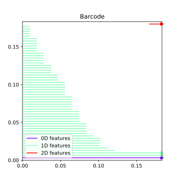
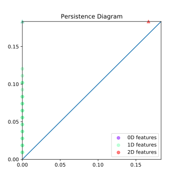
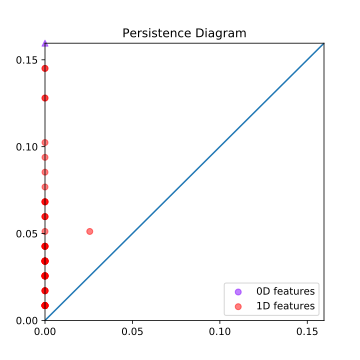

# Introduction

## JavaPlex

JavaPlex is a software package developed by the Computational Topology Workgroup at Stanford University. It implements some algorithms that compute persistent homology, and is based on java.

It has the benefit of being efficient and multi-platform. It can be easily accessed from Matlab and java-based systems.

The project page is here: [https://appliedtopology.github.io/javaplex/](https://appliedtopology.github.io/javaplex/).

<aside class="notes">
    <p>I have chosen to use JavaPlex mainly because it is truly fast flexible, being written in Java.</p>
    <p>Some other popular software packages have important flaws.</p>
    <p>Dionysus lacks documentation, is relatively slow (especially with python bindings), and has bugs that cannot be easily fixed when the ambient dimension of data points is larger than 4.</p>
</aside>

# Computational techniques


## Landmark points

<aside class="notes">
    <p>JavaPlex uses a combination of computational techniques to reduce the amount of calculation. </p>
    <p>Randomly selected landmark points are uneven, and thus might introduce more noise to the calculation.</p>
    <p>Landmark points chosen by maxmin method can be susceptible to outliers, thus obfuscating the real shape of the data.</p>
    <p>In any case, choose the appropriate method according to the data set.</p>
</aside>

First, instead of constructing a persistence module on the entire data set $Z$, a small number of points are selected to represent the structure of the data set. These are called the landmark points, denoted $L = \{l_0, l_1, \dots, l_n\}$.

There are two ways of selecting them, randomly, or inductively by the maxmin of distances.

Specifically, the second method is:
- $l_0$ is chosen randomly.
- When $k$ landmark points are already chosen, chose the point $z\in Z$ to be $l_{k+1}$ if $\min_{i = 0, \dots, k} \{d(z, l_i) \}$ is maximal.

## Witness stream complex

The witness stream complex $W(Z, L, t)$ is indexed by a discrete parameter $t$, taking values in a chosen range.

Let $m_k(z)$ be the distance from a point in $Z$ to its $k+1$-th closest landmark point.

The vertex set of $W(Z, L, t)$ is $L$. 

For $k > 0$ and vertices $l_i$, the $k$-simplex $[l_0 l_1 \dots l_k]$ is in $W(Z, L, t)$ if all of its faces are, and if there exists a witness point $z\in Z$ such that
$$
\max\left\{ d(l_0, z), d(l_1, z), \dots, d(l_k, z) \right\} \leq t + m_k (z) \>.
$$

<aside class="notes">
    <p>Intuitively, if a potential k-simplex is formed by points that are "almost" the nearest k points from a point in the data set, then we add it to the complex. </p>
</aside>

## Homology over fields

Another way of speeding up computation is to calculate homology with coefficients in a field (e.g. $\mathbb Z/p\mathbb Z$ for a prime $p$, or $\mathbb Q$) instead of $\mathbb Z$. 

That will allow us to use standard linear algebra techniques and simply count the ranks of boundary operators, instead of computing the Smith normal form.

<aside class="notes">
    <p>JavaPlex allows us to compute the homology group over Z/pZ for a prime p of our choosing.</p>
    <p>It is optimised for p = 2, and by default uses this field.</p>
</aside>

## A corollary of the universal coefficient theorem

(Corollary 3A.6 of Algebraic Topology by Allen Hatcher:)

**(a)** $H_n(X; \mathbb Q) \simeq H_n(X;\mathbb Z) \otimes \mathbb Q$, so when $H_n(X; \mathbb Z)$ is finitely generated, the dimension of $H_n(X;\mathbb Q)$ as a vector space over $\mathbb Q$ equals the rank of $H_n(X;\mathbb Z)$.

**(b)** If $H_n(X; \mathbb Z)$ and $H_{n-1}(X;\mathbb Z)$ are finitely generated, then for $p$ prime, $H_n(X;\mathbb Z_p)$ consists of

i. a $\mathbb Z_p$ summand for each $\mathbb Z$ summand of $H_n(X; \mathbb Z)$,

ii. a $\mathbb Z_p$ summand for each $\mathbb Z_{p^k}$ summand in $H_n(X;\mathbb Z)$, $k\geq 1$,

iii. a $\mathbb Z_p$ summand for each $\mathbb Z_{p^k}$ summand in $H_{n-1}(X;\mathbb Z)$, $k\geq 1$.

<aside class="notes">
    <p>To understand this theorem, specifically what the "summands" refer to, we need to recall the fundamental theorem of finitely generated abelian groups (FTFGAG).</p>
    <p>A familiar form of the theorem states that the torsion part of the group can be decomposed into successive factors of Z/nZ with each n dividing the next.</p>
    <p>Another form of the theorem states that the torsion part can be decomposed into factors of Z/nZ where each n is a prime power.</p>
    <p>Also the fact that this theorem only applies to finitely generated </p>
</aside>

## Example: $\mathbb RP^2$

We know that 

$$ H_i(\mathbb RP^2; \mathbb Z) = \begin{cases} \mathbb Z & i = 1 \\ \mathbb Z_2 & i = 1 \\ 0 & i \geq 2  \end{cases} \>. $$

Using the corollary, we can calculate the homology groups over $\mathbb Z_p$,

$$ H_i(\mathbb RP^2; \mathbb Z_p) = \begin{cases} \mathbb Z_p & i = 1 \\ \mathbb Z_p & i = 1, p = 2 \\ 0 &  i = 1, p \neq 2 \\ 0 & i \geq 2 \end{cases} \>. $$

<aside class="notes">
    <p>Technically, the corollary doesn't tell us how to calculate the homology in zeroth dimension. However, when the coefficients are in a field, H_0 still counts the connected components. The argument is analogous to the integer coefficient case.</p>
</aside>

# Calculations

## Javaplex library

To use the library, first download the latest `.jar` file from [https://github.com/appliedtopology/javaplex/releases/](https://github.com/appliedtopology/javaplex/releases/).

A somewhat simplified interface is available for Matlab, with examples and a [tutorial](http://www.math.colostate.edu/~adams/research/javaplex_tutorial.pdf) for it.

Otherwise, the java interface can be accessed through jython, Mathematica, or other systems that support loading java libraries.

## Some scripts to make code run

I have also written a few scripts that somewhat simplified the procedure. Download them at [https://github.com/Elliot2560/BasicPersistenceHomology](https://github.com/Elliot2560/BasicPersistenceHomology) by running
```
git clone https://github.com/Elliot2560/BasicPersistenceHomology
```
or just downloading the zip.

It includes a java program that computes the persistence homology, and a python program that plots diagrams from the result.


## Running with Eclipse
- Use `File > Open Projects from File System` to import the directory `BasicPersistentHomology/java.`
- Go to `File > Properties > Java Build Path`, select the `Libraries` tab.
- Use `Add External JARs` to add the `javaplex-4.2.5.jar` library file.
- Open the `Main.java` file, run by clicking on `Run > Run`, or hit `Ctrl+F11`.

## Running with Intellij IDEA

- Use `File > New > Project from Existing Sources` to open the directory `BasicPersistentHomology/java`.
- Keep hitting `Next` until a new project is created.
- Go to `File > Project Structure > Modules`.
- On the `Dependencies` tab, click on the "+" button, use the first option to add the `javaplex-4.2.5.jar` file.
- Open the `Main.java` file, run by right clicking and selecting `Run 'Main.main()'`, or hit `Ctrl+Shift+F10`.

## Directly compiling and running

In a terminal,
- Go to the `BasicPersistentHomology/java` directory.
- Compile:
```
> javac -classpath /dir/to/javaplex-4.2.5.jar Main.java
```
(edit `/dir/to/javaplex-4.2.5.jar` to the actual file path of the library).
- Run:
```
> java -classpath .:/dir/to/javaplex-4.2.5.jar Main
```

## Input

The input is a text file containing the coordinates of points in the dataset.

Each line of the input file represents a point. The coordinates are separated by commas. Every point should have the same dimension.

For example:
```
5.1,3.5,1.4,0.2
4.9,3.0,1.4,0.2
4.7,3.2,1.3,0.2
4.6,3.1,1.5,0.2
...
```

## Parameters

| Parameters         | Description                              |
| ------------------ | ---------------------------------------- |
|`String inputFile  `| Full file url of the input file.         |
|`String outputFile `| Full file url of the output file         |
|`int characteristic`| Characteristic of the coefficient field. |
|`int numLandmarkPoints`|Number of points sampled from the data set.|
|`int maxDimension`|The maximum dimension for which the persistence homology is computed|
|`double filtrationRatio`|Determines the maximum filtration index used to generate the witness complex.|
|`int numDivisions`|Number of steps to take when generating the complex.|

<aside class="notes">
    <p>When characterstic is a prime p, the homology groups are calculated over Z/pZ. When it is zero, the default algorithm of javaplex is used, which should be over Z/2Z.</p>
    <p>The filtrationRatio and numDivisions parameters determine the set of filtration indices (t in the definition of the witness complex). </p>
    <p>The larger filtrationRatio is, the larger the maximum of t is.</p>
    <p>The larger numDivisions is, the more steps there are between 0 and the maximum of t when computing the complex.</p>
</aside>

## Plotting diagrams

The python program `plot_persistence.py` can visualize the output of the program by plotting the barcode and persistence diagrams. Matplotlib and python3 are required to run it.

Under Windows, execute the following in command line
```
> py -3 plot_persistence.py [arguments]
```

Under macOS and Linux, run
```
> python3 plot_persistence.py [arguments]
```

Use the `-h` or `--help` option to see the help message for the program.

# Results

## Persistence intervals

The output of the program looks like,
```
Dimension: 0
[0.0, 0.007937253933193769)
...
[0.0, infinity)
...
Dimension: 1
[0.0, 0.015874507866387538)
...
Dimension: 2
[0.07143528539874391, 0.07937253933193769)
...
```

Each of the interval represents the birth and life "time" of a "feature" (a homology class) in the persistence module. 

<aside class="notes">
    <p>If at time t, a new simplex is added to the complex, and in n-th dimension, a feature (homology class) appeared, then we say the feature is born at time t.</p>
    <p>All zero dimensional features are born at t=0. In witness complexes, there may even be higher dimensional features born at this time.</p>
    <p>If then at time t', a new simplex is added, and in n-th dimension, a feature disappears, then we identify the underlying homology class, find its birth time, and mark that feature as dead, and output a persistence interval in dimension n.</p>
    <p>Often with the addition of a k-simplex, a k-1 feature is killed and a k feature is born, but both need not happen.</p>
</aside>

## Barcode diagrams and persistence diagrams

The persistence intervals can be represented directly as barcodes, or as persistence diagrams. In persistence diagrams, the horizontal axis is the birth time of a feature, and the vertical axis is the death time of a feature.

As an example, the following are the barcode and persistence diagrams of a torus:

<div style="text-align: center;">
{ width=32% } { width=32% }
</div>

<aside class="notes">
    <p>At any time t, the number of barcodes give the Betti number in each dimension of the complex.</p>
    <p>The features that survive until infinity are the robust topological features of the underlying space.</p>
    <p>Ideally, we want to embed a data set into an ambient space that preserves the distance between data points as much as possible. Here the points on the torus is sampled from an embedding in R^4. If we were to further embed it into R^3, then the result may become quite unsatisfactory, because the distances are distorted.</p>
</aside>

## Projective plane

We can use JavaPlex to calculate the persistence homology of $\mathbb RP^2$ over different fields and see what kind of torsions are present in the homology groups.

Recall that the one dimensional homology groups are different over $\mathbb Z/p\mathbb Z$ for different $p$. When $p = 2$, the homology group is $\mathbb Z/2\mathbb Z$, otherwise it is $0$.

## Persistence homology of projective plane over $\mathbb Z/2\mathbb Z$

<div style="text-align: center">
{ width=32% } { width=32% }
</div>

## Persistence homology of projective plane over $\mathbb Z/3\mathbb Z$

<div style="text-align: center">
{ width=32% } { width=32% }
</div>

## Persistence homology of projective plane over $\mathbb Z/5\mathbb Z$

<div style="text-align: center">
{ width=32% } { width=32% }
</div>

## Iris data set

Iris data set is a classic data set used to verify an algorithm's pattern recognition capability. Each data point is a set of four real numbers, and there are four clusters of points.

Persistent homology can identify the connected components of the data set.

<div style="text-align: center">
{ width=32% } { width=32% }
</div>
